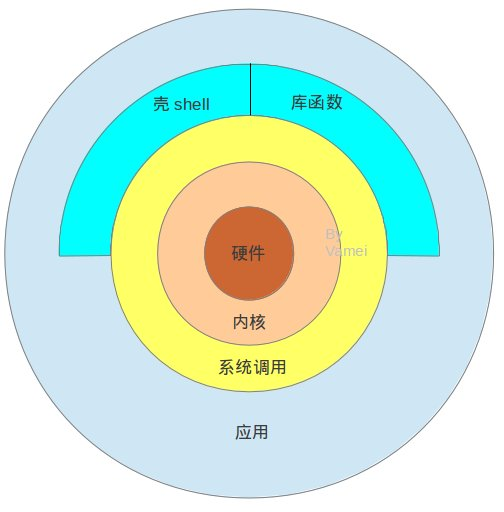

note of [vamei blog](http://www.cnblogs.com/vamei/archive/2012/10/10/2718229.html)
>[Everything Is a File](http://www.howtogeek.com/117939/htg-explains-what-everything-is-a-file-means-on-linux)

一切系统资源都是一个文件描述符

- <a href="#bootstrap">bootstrap启动顺序</a>
- <a href="#file">文件管理：ln，umask权限</a>
- <a href="#structure">架构</a>
- <a href="#command">常用命令</a>
- <a href="#filestream">输入输出文本流</a>
- <a href="#process">进程机制与“&”后台运行</a>
- <a href="#signal">内核的信号机制</a>
- <a href="#auth">权限：最小权限原则</a>
- <a href="#mutex">多线程与同步:同步 互斥锁(mutex)，条件变量(condition variable)和读写锁(reader-writer lock)</a>
- <a href="#ipc">IPC</a>

<a name="bootstrap">

## bootstrap启动顺序

[BIOS -> MBR -> boot loader -> kernel -> init process -> login](http://www.cnblogs.com/vamei/archive/2012/09/05/2672039.html)

<a name="file">

## 文件管理

$PWD Linux会在进程中，维护一个工作目录(pre sent working directory)的变量

文件出现在一个目录文件中时，硬链接(hard link)。一个文件允许出现在多个目录中，多个硬链接。当硬链接的数目(link count)降为0时，文件会被Linux删除。所以很多时候，unlink与remove在Linux操作系统中是一个意思。由于软链接(soft link)的广泛使用(soft link不会影响link count，而且可以跨越文件系统)

软链接(soft link，也叫做symbolic link)就是linux的快捷方式。软链接本质上是一个文件，它的文件类型是symbolic link。在这个文件中，包含有链接指向的文件的绝对路径

ls -l file 文件权限的信息保存在文件附加信息(metadata)

创建文件的时候，比如使用touch，它会尝试将新建文件创建为权限666，也就是rw-rw-rw-。但操作系统要参照权限mask来看是否真正将文件创建为666。权限mask表示操作系统不允许设置的权限位，比如说037(----wxrwx)的权限mask意味着不允许设置设置group的wx位和other的rwx位。如果是这个权限mask的话，最终的文件权限是rw-r----- (group的w位和other的rw位被mask)。

我们可以通过

$umask 022

的方式改变权限mask。

<a name="structure">

## 架构

<a name="command">

## command

- type
- sudo
- which #在默认路径中搜索命令，返回该命令的绝对路径
- whereis #在相对比较大的范围搜索命令，返回该命令的绝对路径
- whatis #用很简短的一句话来介绍命令
- man #查询简明的帮助手册
- info #查询更详细的帮助信息
- history #来查询之前在命令行的操作

使用Tab自动补齐，向上箭头查询历史;中途停止，Ctrl + c;暂时停止，Ctrl + z。

[文件管理相关命令](http://www.cnblogs.com/vamei/archive/2012/09/13/2682519.html)

<a name="filestream">

## 文本流

>"everything is a file"是通常所流传的UNIX设计的哲学之一，但Linus对此作出纠正，改为"everything is a stream of bytes"

Linux执行一个程序的时候，会自动打开三个流，标准输入(standard input)，标准输出(standard output)，标准错误(standard error)

- \> >>（append）重新定向标准输出
- < 改变标准输入。比如cat命令，它可以从标准输入读入文本流，并输出到标准输出 `cat < a.txt`
- echo 将文本流导向标准输出
- \>& 重新定向标准输出和标准错误
- 2> 重新定向标准错误
- | 管道可以将一个命令的输出导向另一个命令的输入
- wc [-lwm] path
	- l  ：仅列出行；
	- w  ：仅列出多少字(英文单字)；
	- m  ：多少字符；

<a name="process">

## process

first process : init

fork(复制内存空间，创建附加信息),exec(清空自身内存空间的text, global data, heap和stack，并根据新的程序文件重建,运行),wait(exit code 0 正常结束)

进程组 (process group) pgid 可以将信号发送给一个进程组

会话 (session) 进程组的领导进程创建 意义在于将多个工作囊括在一个终端，并取其中的一个工作作为前台，来直接接收该终端的输入输出以及终端信号。 其他工作在后台运行。

`$ping localhost > log &` 在末尾加上&方式让它在后台运
 
 [详见](http://www.cnblogs.com/vamei/archive/2012/10/07/2713023.html)

<a name="singal">

## singal

信号是由内核(kernel)管理

信号所传递的每一个整数都被赋予了特殊的意义，并有一个信号名对应该整数。常见的信号有SIGINT, SIGQUIT, SIGCONT, SIGTSTP, SIGALRM

$man 7 signal

kill -SIGCONT  27397 #来传递SIGCONT信号给ping进程。

<a name="auth">

## [权限](http://www.cnblogs.com/vamei/archive/2012/10/07/2713593.html)

当我们去编写一个Linux应用程序的时候，就要注意在程序中实现以上切换(有必要的前提下)，以便让我们的程序符合"最小权限"的原则，不给系统留下可能的安全隐患

<a name="mutex">

## Linux多线程与同步

同步 互斥锁(mutex)，条件变量(condition variable)和读写锁(reader-writer lock)来同步资源

- mutex
	- lock
	- unlock
- condition variable 条件变量特别适用于多个线程等待某个条件的发生
- reader-writer 共享读取（可获取R锁，不可写入），互斥写入

<a name="ipc">

## IPC

某个进程终结之后，该进程需要被其父进程调用wait，否则进程成为僵尸进程(Zombie)

- pipe 缓冲文件流
- 传统IPC
	- semaphore + 共享内存
		- semaphore 计数锁 vs mutex(n)
		- 共享内存 允许多个进程直接对同一个内存区域直接操作，效率最高的IPC方式 vs gloabl var
	- 消息队列(message queue)与PIPE相类似。它也是建立一个队列
