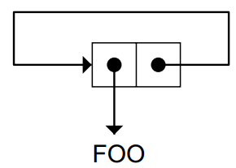

#Assignment

##UPDATINGA GLOBAL VARIABLE

	(setf *total-glasses* 0)
	>(+ *total-glasses* 3)

##incf decf macros

	> (setf a 2)
	2
	> (incf a 10)
	12
	> (decf a)
	11

##The PUSH and POP Macros

`push item var_stack`

`(pop var_stack)`

##when unless
> == if (java)

The only advantages of WHEN and UNLESSover COND are stylistic（文体）

##GENERALIZED VARIABLES

	(setf x ’(jack benny was 39 for many years))
	(setf (sixth x) ’several)
	> x
	(JACK BENNY WAS 39 FOR SEVERAL YEARS)

##Lisp Toolkit: BREAK and ERROR

##DIY list

use SETF on generalized variables to manipulate pointers directly

	> (setf (cdr circ) circ)
	(FOO FOO FOO FOO ...)

##DESTRUCTIVE OPERATIONS ON LISTS

have names thatbegin with N

###NCONC

> a destructive version of append
>If the first input to NCONC is NIL, it just returns its second input

	> (setf x ’(a b c))
	(A B C)
	> (setf y ’(d e f))
	(D E F)
	> (append x y) Doesn’t change X or Y, but
	(A B C D E F) result shares structure with Y.
	> x X is unchanged.
	(A B C)
	> (nconc x y) NCONC alters the list (A B C).
	(A B C D E F)
	> x X’s value has changed.
	(A B C D E F)
	> y Y’s has not.
	(D E F)

###NSUBST

> a destructive version of SUBST

###Other Destructive Functions

NREVERSE, NUNION, NINTERSECTION, andNSET-DIFFERENCE

