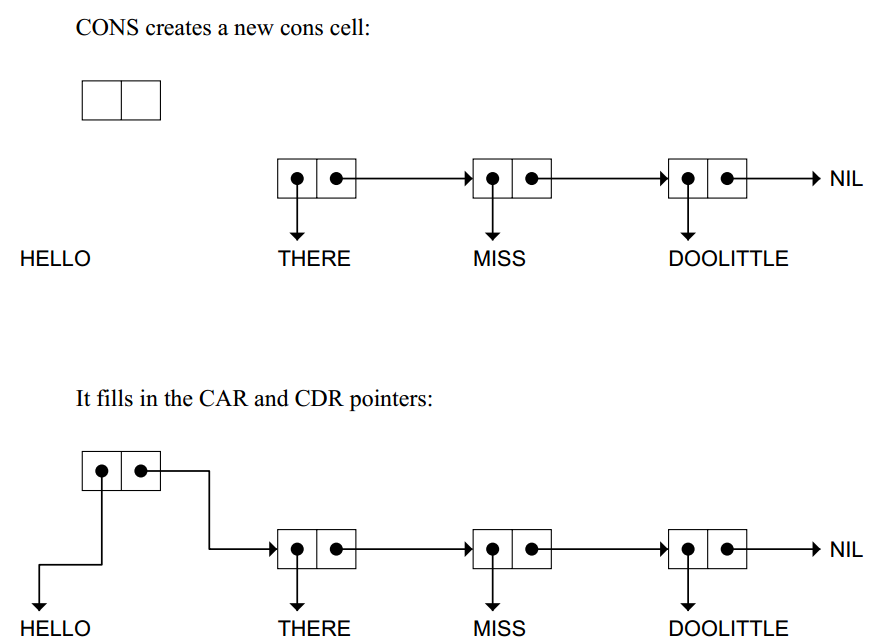
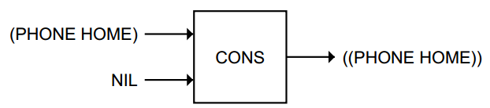
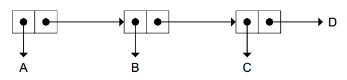
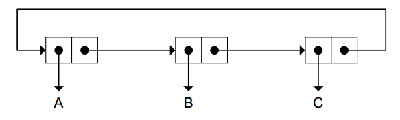

#list
Listsare importantbecause they can be made to represent practically
anything: sets, tables, and graphs, and even English sentences.

Functionscan
also be represented as lists

Every list has two forms: a printed representation and an internalone. --API & reality in memory

`((BLUE SKY)
(GREEN GRASS)
(BROWN EARTH))`

##LENGTH

NIL and the empty list are identical, `(A NIL B)`can
also be written `(A( ) B)`

##FIRST,SECOND, THIRD, AND REST(return list except first)

##C...R
CAR CDR

Besides naming the two halves of a cons cell, CAR and CDR are also the
names of built-in Lisp functions that return whatever pointer isin the CAR or
CDR half of the cell, respectively.

reverse order CADR = INPUT-->CDR-->CAR

##CONS
The CONS function creates cons cells.Ittakes two inputs and returns a
pointer to a new cons cell whose CAR points to the first input and whose CDR
points to the second.

 it returns a pointer to the new cell

To really understandwhat CONS does, it is better to think about it **using
cons cell notation.**

second input better be a list,or seems wired cause output is not a list(for right point to a non-cons cell)

x = CONS of (CAR of x) and (CDR of x) **when x is not NIL**

##LIST
mutiple inputs

##LISTP & CONSP &ATOM
CONSP is
almost the same as LISTP; the difference is in their treatment of NIL. NIL is a
list, but it is not a cons cell.(no memory block)

ATOM and CONSP are opposites
##NULL
The NULL predicate returnsT if its input is NIL
####dotted list
`(A B C . D)`

##circular list

 ‘‘sharp-equal notation,’’

We will use integers for labels, and the notation #n= to label an object

`\#1=(A B C . #1#)`

`\#1=(#1# . A)`

The LENGTH of a listis the number of top-level cons cells in the chain.
Therefore the length of (A B C . D) is 3, not 4.
##SUMMARY
The important points about CAR and CDR are:

-  CAR and CDR accept only lists as input.
- FIRST and REST are the same as CAR and CDR.
- SECOND and THIRD are the same as CADR and CADDR.
- Common Lisp provides built-in C...R functions for all
combinations of CAR and CDR up to andincluding four As and
Ds.

The symbol NIL has several interesting properties:

- NIL is a symbol. It is the only way to say ‘‘no’’ or ‘‘false’’ in
Lisp.
- NIL is a list. It is the empty list; its LENGTH is zero.
- NIL is the only Lisp object that is both a symbol and a list.
- NIL marks the end of a cons cell chain. When lists are printed in
parenthesis notation, the NILs at the end of chains areomitted by
convention.
- NIL and () are interchangeable notations for the same object.
- The CAR and CDR of NIL are defined to be NIL.