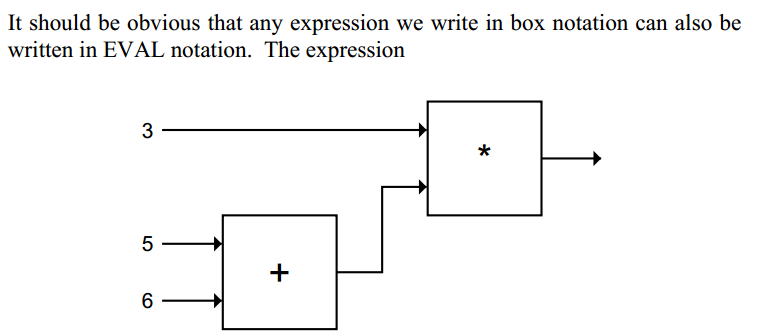
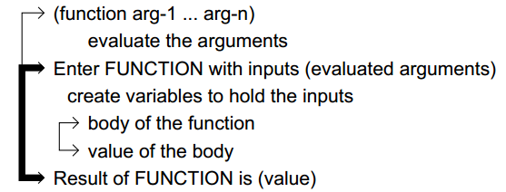
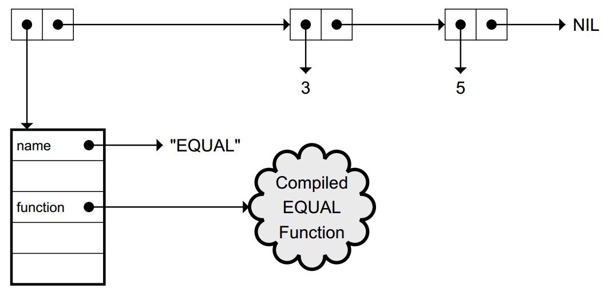

#EVAL Notation
@函数式编程初探 in EverNote-Lisp

In Lisp,functions are data

EVALNOTATION CAN DO ANYTHING BOX NOTATION CAN DO

- Evaluation Rule for Numbers, T, and NIL: Numbers, and the symbols T
and NIL, evaluate to themselves.
- Evaluation Rulefor Lists: The first element of the list specifies a
function to be called. The remaining elementsspecify arguments to the
function. Thefunction is called on the evaluated arguments.
- Evaluation Rule for Symbols: A symbol evaluates to the value of the
variable it refers to.

##macro function 宏函数
(defun funciont_name (argument list) (body))

	(defun average (x y)
	(/ (+ x y) 2.0))

Variables are not symbols; variables are
named by symbols. Functionsare also named by symbols.

##Evaltrace notation

##USINGSYMBOLS AND LISTS AS DATA
unassigned variable error
	(defun riddle (x y)
	(list ’why ’is ’a x ’like ’a y))
	
	(riddle ’raven ’writing-desk) ⇒
	(why is a raven like a writing-desk)

Lists also need to be quoted to use them as data

	(first (we hold these truths))
	⇒ Error! WE undefined function.
	(first ’(we hold these truths)) ⇒ we

example

	(+ 1 2) ⇒ 3
	’(+ 1 2) ⇒ (+ 1 2)
	(oddp (+ 1 2)) ⇒ t
	(oddp ’(+ 1 2)) ⇒ Error! Wrong type input to ODDP.

##making list

	’(foo bar baz) ⇒ (foo bar baz)
	(list ’foo ’bar ’baz) ⇒ (foo bar baz)
	(cons ’foo ’(bar baz)) ⇒ (foo bar baz)

*old style* quote = '

	’’foo ⇒ ’foo also written (quote foo)
	(list ’quote ’foo) ⇒ (quote foo) also written ’foo
	(first ’’foo) ⇒ quote

##INTERNALSTRUCTURE OF SYMBOLS
(EQUAL 3 5) 

##lambda
LAMBDA is not a function;it is a marker treated specially by EVAL.

lambda is the symbol for an anonymous function

`(lambda (x y) (+ (* 3 x) (* y y)))`

##FUNCTIONSTHAT MAKE FUNCTIONS

It is possible to write a function whose value is another function
	
	(defun make-greater-than-predicate (n)
	#’(lambda (x) (> x n)))