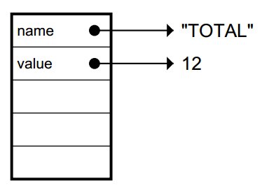
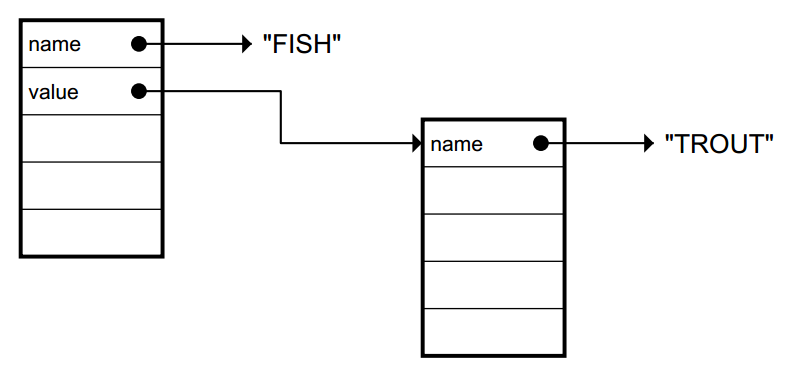
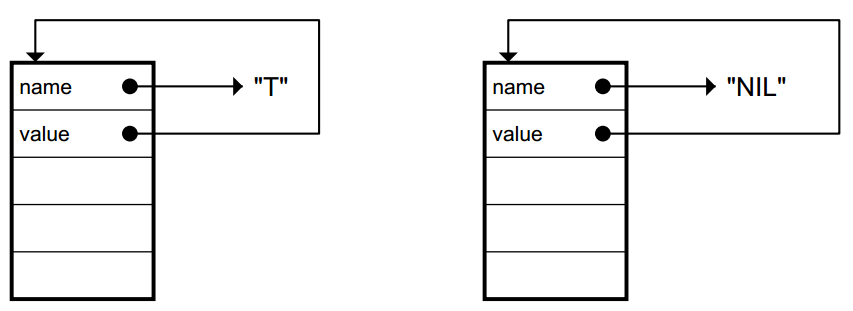
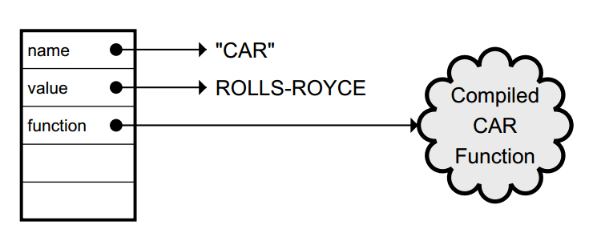

#Variables and Side Effects
Every variable has a scope

##setf

`(setf vowels ’(a e i o u))`

##random

	> (random 5)
	1
	> (random 5.0)
	2.32459

##let LET*

	(LET ((var-1 value-1)
	(var-2 value-2)
	...
	(var-n value-n))
	body)

e.g.

	(let ((x 2)
	(y ’aardvark
	(list x y))

LET* creates the local
variables one at a time instead of all at once

##Lisp Toolkit: DOCUMENTATION and APROPOS

want to find all the built-in functions andvariables containing "TOTAL" in
their name. You can do this with APROPOS:

`> (apropos "TOTAL" "USER")`
`ARRAY-TOTAL-SIZE (function)`
`ARRAY-TOTAL-SIZE-LIMIT, constant, value: 134217727`

###comment

	;;; Function to compute Einstein’s E = mc^2
	(defun einstein (m)
	(let ((c 300000.0)) ; speed of light in km/sec.
	;; E is energy
	;; m is mass
	(* m c c)))

##value internal

symbols have separate function andvalue cells

Common Lisp determines whether a symbol refers to a function or a
variable based on the context in which it appears

