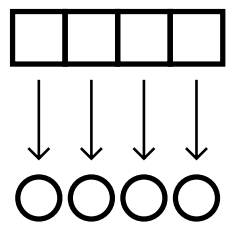
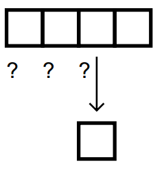
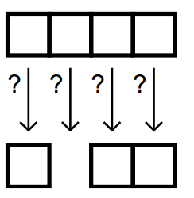

#Applicative Programming 
> =  functional programming 函数式编程

The three programming styles wewill cover in this book are applicative
programming, recursion, and iteration

based on the idea that functions are data, just
like symbols and lists are data, so one should be able to pass functions as
inputs to other functions, and also return functions as values

These operators are all built from a primitive function known as FUNCALL

##FUNCALL

`(funcall #’cons ’a ’b) ⇒ (a . b)`

Note that only ordinaryfunctions can be quoted with #’. Itis an error to
quote a macro function or special function this way

	> (setf fn #’cons)
	#<Compiled-function CONS {6041410}>
	> fn
	#<Compiled-function CONS {6041410}>
	> (type-of fn)
	COMPILED-FUNCTION
	> (funcall fn ’c ’d)
	(C . D)

##THE MAPCAR OPERATOR

Itapplies a
function to each element of a list

`> (mapcar#’square ’(1 2 3 4 5))
(1 4 9 16 25)`

###mutiple list

	> (mapcar #’+ ’(1 2 3 4 5) ’(60 70 80 90 100))
	(61 72 83 94 105)

##find-if

	> (find-if #’(lambda (x) (> x 3))
	’(2 4 6 7 8 9))
	4

##REMOVE-IFAND REMOVE-IF-NOT

##reduce

`(reduce #’+ ’(1 2 3)) ⇒ 6`

##every

EVERY takes apredicate and a list as input. It returns T if there is no element
that causes the predicate to return false.

	> (every #’(lambda (x) (> x 0)) ’(1 2 3 4 5))
	T

##trace

...

##fucntion

\#’ is shorthand for the
FUNCTION special function

##WRITINGAN APPLICATIVE OPERATOR

	(defun inalienable-rights (fn)
	(funcall fn
	’(life liberty and the pursuit of happiness)))

##FUNCTIONSTHAT MAKE FUNCTIONS

	
	(defun make-greater-than-predicate (n)
	#’(lambda (x) (> x n)))

