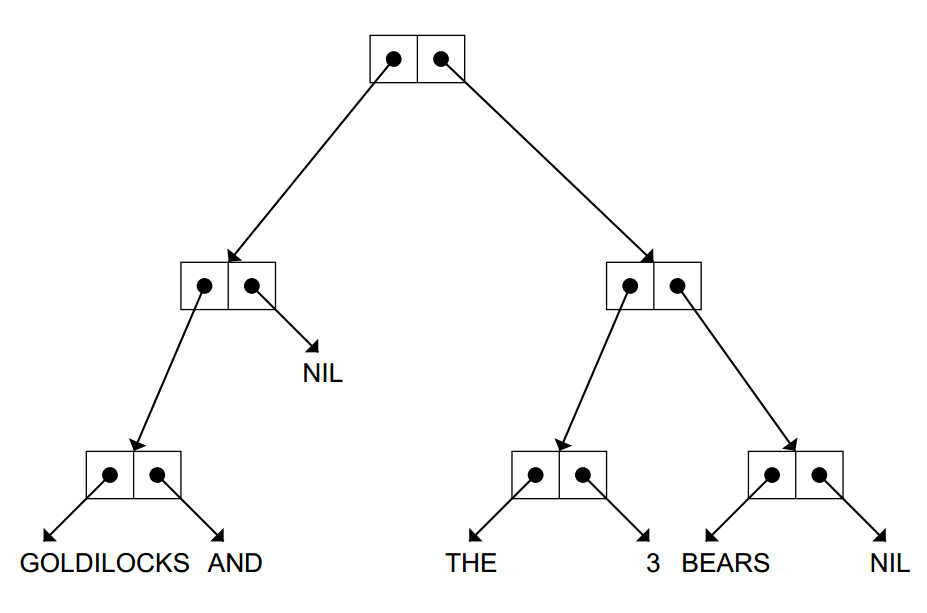

#Recursion

##search ood number in list

###recurion construction

- end condition
- logic code and recursive call

e.g.
	
	(defun anyoddp (x)
	(cond ((null x) nil)
	((oddp (first x)) t)
	(t (anyoddp (rest x)))))

##THE THREE RULES OF RECURSION

1. Know when to stop.
2. Decide how to take one step.
3. Break the journey down into that step plus a smaller journey.

##templates

###Double-Test Tail Recursion

	(DEFUN func (X)
	(COND (end-test-1 end-value-1)
	(end-test-2 end-value-2)
	(T (func reduced-x))))

###Single-Test Tail Recursion

	(DEFUN func (X)
	(COND (end-test end-value)
	(T (func reduced-x))))

###Augmenting Recursion

Instead of dividing the
problem into an initial step plus asmaller journey, they divide it into a smaller
journey plus a final step

	(DEFUN func (X)
	(COND (end-test end-value)
	(T (aug-fun aug-val
	(func reduced-x)))))
	
e.g.
	
	(defun count-slices (x)
	(cond ((null x) 0)
	(t (+ 1 (count-slices (rest x))))))

##List-Consing Recursion

As each
recursive call returns, we createone new cons cell.

	
	(DEFUN func (N)
	(COND (end-test NIL)
	(T (CONS new-element
	(func reduced-n)))))

##Multiple Recursion
	
	(DEFUN func (N)
	(COND (end-test-1 end-value-1)
	(end-test-2 end-value-2)
	(T (combiner (func first-reduced-n)
	(func second-reduced-n)))))

##TREES AND CAR/CDR RECURSION

	(DEFUN func (X)
	(COND (end-test-1 end-value-1)
	(end-test-2 end-value-2)
	(T (combiner (func (CAR X))
	(func (CDR X))))))

##THE LABELS SPECIAL FUNCTION
	
	(LABELS ((fn-1 args-1 body-1)
	...
	(fn-n args-2 body-2))
	body)

##RECURSIVE DATA STRUCTURES

S-expression (‘‘symbolic expression’’)

###defined recursivly

An S-expression is either an atom, ora cons cell whose CAR and
CDR parts are S-expressions.

e.g.

tree