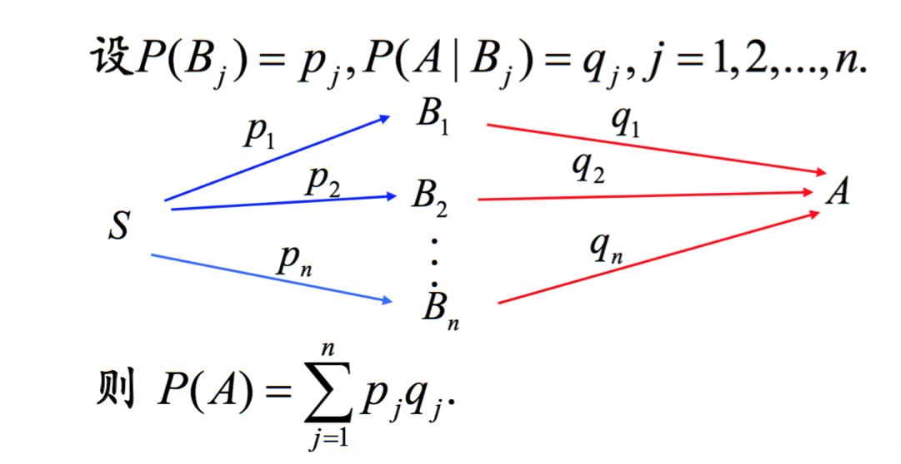
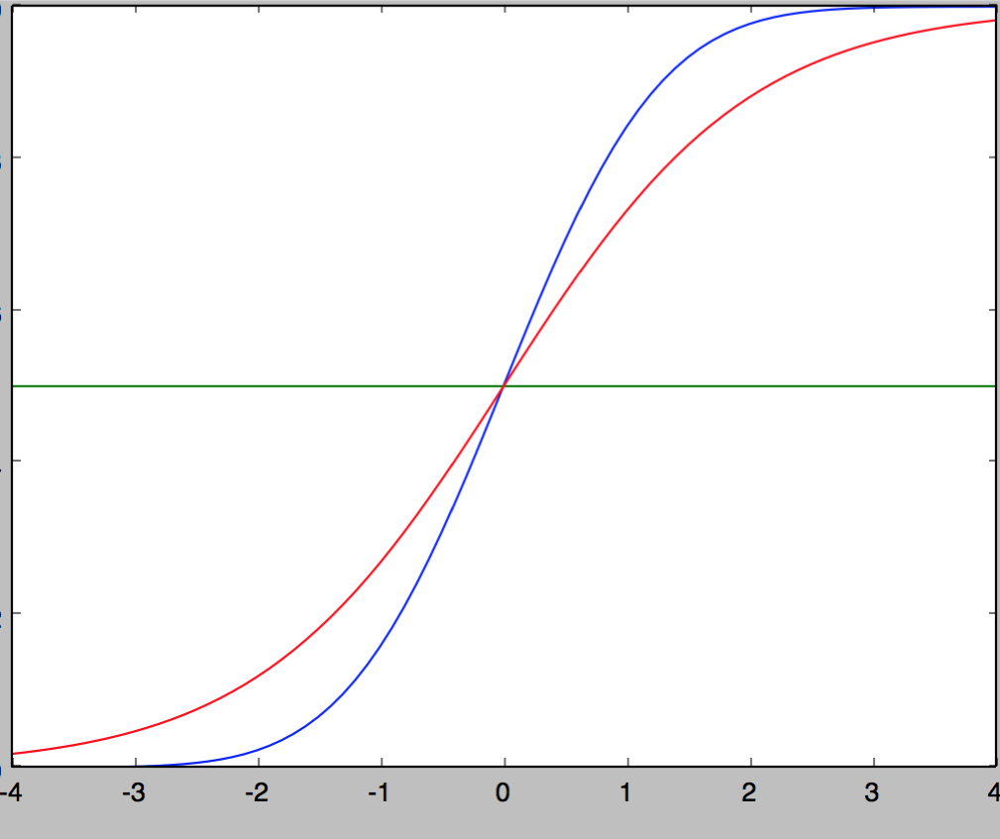

##matrix

静态：坐标系；动态：映射变换

## 递归 ／ 循环 － 图模型

用来划分子问题 : 基本单元 ＋ 衍生方式

递归: 是一种定义了 基本单元＝基本逻辑迭代单元＋基本结束单元(if-else)，以此无限重复自身逻辑的数学模型

	if {end-node}
	else {
	logic－node + doors(自身调用)
	}
	
	想象递归是个基本逻辑体＋跳转口（跳到下个基本逻辑体，一个或多个）随意画的图形单元;这个单元以画制的路径自我衍生

循环: 类似递归，定义了 基本单元＝基本逻辑迭代单元，已知执行结束流程线的数学模型

	想象循环是个没有跳转口的基本逻辑体的图形单元;这个图形单元以静态画制的一条直线路径自我衍生

递归 / 循环 － 执行模型

	递归对基本单元的出入衔接口（每个衔接口可自由跳入新的执行单元中）自由定义，代价是空间消耗；而循环限定死了每个基本单元的进出方式，所以节省了空间图模型的那部分空间消耗
	
	递归的执行绘制流 是栈式 LIFO；循环是队列式 FIFO

##算法

动态规划》》 递归的优化，记录了路径计算的结果，减少了重复计算

##科学 & 艺术

本质都在寻找一种精确

科学尝试寻找规律，塑造精确；艺术通过尝试无数遍后，捕捉灵感，暴力实验获得精确

##人生轨迹

串起来，读懂命运

## 欧拉公式

e^(i*x) = cos(x) + i * sin(x) 欧拉公式所描绘的，是一个随着时间变化，在复平面上做圆周运动的点

## 复数

保留了二维信息

旋转正交

## soul of statistics

all probabilities are conditional;Allways think about how data were sampled;@blind-touch-elephant

## 最小二乘 vs 相对熵 ？

同样考虑整体分布，最小二乘从大到小，更关注大距离的点，忽视小距离的点（为0）；相对熵反向，从小到大，分布近的给更大的负值

逻辑回归的代价函数 为啥是 ylog(sigmod(Θx)) + (1-y)log(1-sigmod(Θx)) == 相对熵

## 全概率

图形角度>>> 全概率公式成立的条件＝B(1...n)交集空并集全 == 完美分割

LR就是在假定feature符合B（交集空并集全）求全概率

神经网络做同样的事情，降低了LR对假设的依赖，多了几层网络逼近假定B（交集空并集全）

## 神经网络FP算法

神经网络的每个节点计算的是当前节点在之前几层节点条件下的条件全概率

每一层是对前一次的分类的再分类，逐渐细化的过程。

概率图形角度：从n个有交集的模糊分割，到K个分类的完美分割不断逼近的过程；这个过程熵不断减少

生物角度：从简单特征到复杂特征的逐层识别

## 神经网络BP算法

cost-function的偏导数

## 高斯核处理输入信号（(x-mean(x))/std(x)）^2

假定将样本每个独立点映射到按高斯分布（假定）的空间下

## 以(x-mean(x))/std(x) normalize输入

减去平均，除以振幅

## 为什么用sigmod

模拟正态分布，不算积分，计算性能优化

	这两条曲线分别是sigmoid函数和正态分布的概率函数。二者非常近似，误差是:0.005.推断，之所以使用sigmoid函数进行计算，是因为这个函数与正态分布的概率函数很近似,正态分布的概率函数 只存在于积分形式，无法得到函数的具体表达式，而使用积分形式计算效率太低，所以使用了sigmoid来近似逼近正态分布的概率函数

## 逻辑回归在计算什么

Θ＊X逼近理想模型下的均值计算，sigmod模拟正态分布函数到正态累积概率函数的转换；也就是**模拟计算全概率**

	在理想－model中，按中心极限定理，样本在独立特征空间下的均值符合高斯分布，这样m足够大是，可以将一条记录的均值转成正态分布下的概率输出

	现实模型中样本－特征输入，调整参数Θ使Θ＊X逼近理想模型下均值的计算（相当于理想模型中正交的特征，等权重的特征axis），然后用sigmod模拟计算正态分布的概率函数

	@中心极限定理，，随机变量X1,X2,...,Xn是相互独立的随机变量，并有相同的分布(IID, independent and identically distributed) 。当n趋进无穷时，均值(一个新的随机变量)趋近一个正态分布
	
## feature scaling 多变量输入数据归一化的原因

[@归一化blog](http://www.cnblogs.com/LBSer)

- 等高线圆润
- 欧式距离的等函数的因子影响一致;梯度下降速度快
- 线性归一化：如正态分布

## 随机变量的期望

总体population数量无穷时的总体mean

## 决策树

模拟人类对概念进行判定的树形流程

