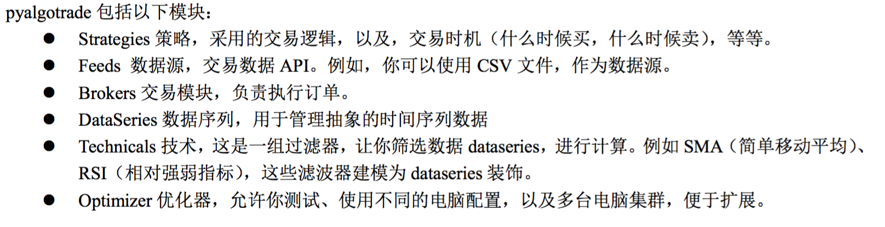

1. Declare a strategy/event
1. Add feed
1. Attach and Run the analysis.
1. Plot the results.

## feed

barfeed -> barparser -> bars -> bardataseries( => SequenceDataSeries => DataSeries)

自定制的BarFeed 多参考@GenericBarFeed/GenericRowParser in csvfeed.py

- bards.py
	- BarDataSeries时间数据序列，`__init__`定制长度
	- 在回测过程中不断append
	- @collections.ListDeque

## order

- MarketOrder 快速交易单
- LimitOrder 限价单
- StopOrder 止损单
- StopLimitOrder 止损限价单

价格在commitOrderExecution 是price = fillInfo.getPrice()

## BacktestingStrategy

cash_or_brk: int or live broker

## use adjust value 

这个由feed保证处理